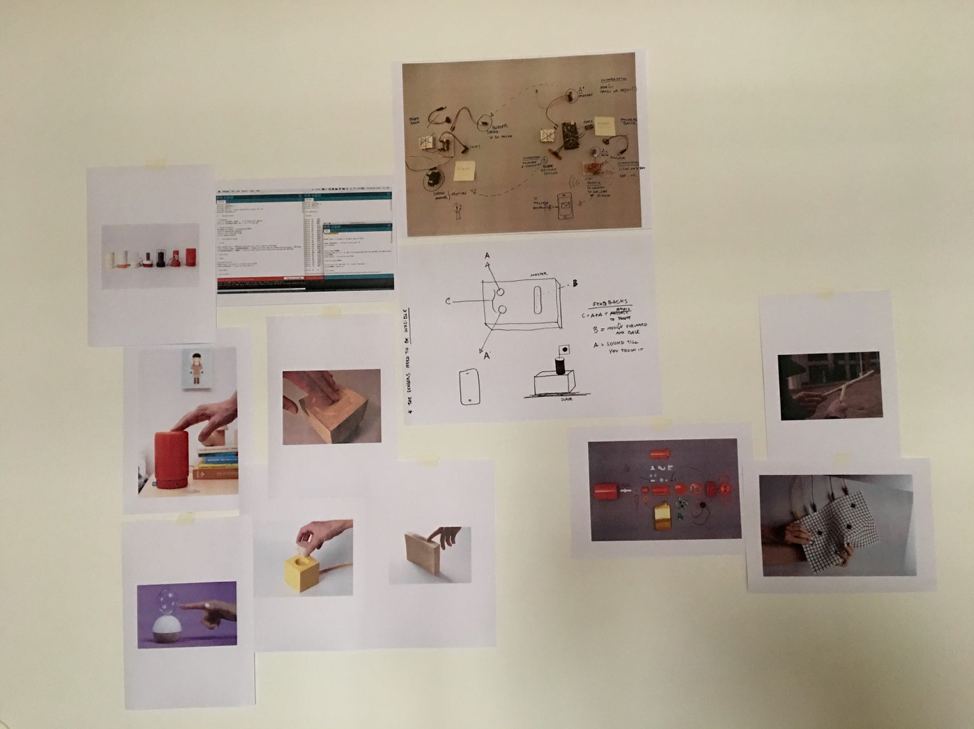
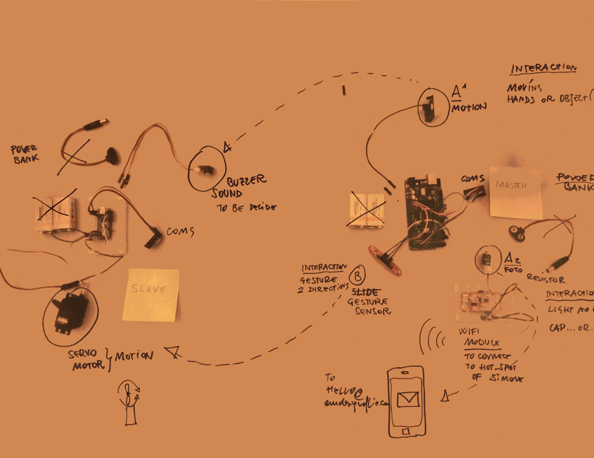
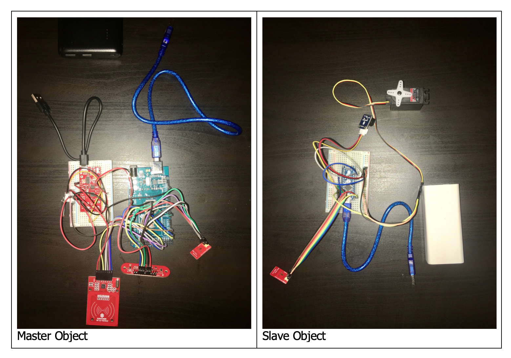

# SMART OBJECTS #

I worked on a project to create these smart objects that the company would use to demo IoT capabilities to clients.
My role was the technical side to program Arduino boards and sensors to detect variable gestures and provide intuitive feedback.
Our vision board looked as shown in the diagram below and we successfully over the coming months implemented and built the working prototypes. 

Fig 1: Vision board

The idea was to make smart objects, that based on how it was designed, the user can intuitively discern how to interact with the object.  The objects were divided into two categories the Master and slave objects, physical interaction was performed on the master and the slave provided feedback through select actions.

Sensors we made use of include:
1. Photo resistor - a light-controlled variable resistor. The resistance of a photo resistor decreases with increasing incident light intensity; in other words, it exhibits photoconductivity.
2. RFID - Uses electromagnetic fields to automatically identify and track tags attached to objects.
3. Gesture sensor - is a touch-less sensor that is capable of looking for simple gestures. It works by bouncing infrared (IR) beams of light from the two LEDs on either side off of an object above the sensor. The bounced light returns to the receiver in the centre of the sensor, and a micro controller on the back of the sensor interprets the data. 

Feedback components we used include:
1. Piezo buzzer - An audio signaling device, which may be mechanical, electromechanical, or piezoelectric. Typical uses include alarm devices, timers, and confirmation of user input such as a mouse click or keystroke.
2. Servo motor - A rotary actuator or linear actuator that allows for precise control of angular or linear position, velocity and acceleration.
3. ESP8266 - Is a low-cost Wi-Fi chip with full TCP/IP stack and MCU (micro controller unit) capability.

Different inputs on the master controlled the different feedback events on the slave object as follows:

 
Fig 2: Components layout

- Light sensor - Difference in light values was programmed to send a notification email using the ESP8266 Wi-Fi chip which allowed the device to connect to the internet and using an SMTP service and Gmail to achieve this. 
- RFID - With a small RFID tag, whenever it would come into contact with this third object it would make the buzzer on the slave to make a beep sound. 
- Gesture sensor - This sensor was able to detect movements above it, swipes and gestures would result in the servo motor to turn in either clockwise or anticlockwise direction.
All communication was done wirelessly between these two objects through custom chips nRF24L01. The power needs for this objects was achieved using power banks to make the project more portable and untethered. 

 
